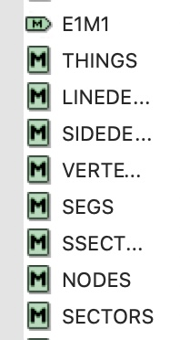
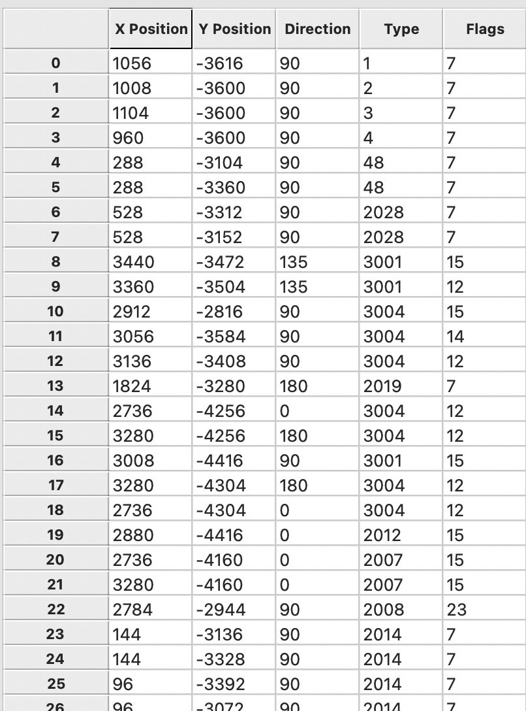

# 02A-Wad_file

Alright let's start extracting the data from the WAD

We will get the data for the maps



First we need to find the map index

```python
def findMapIndex():
    for i in range(directoryCount):
        name = read8bytes(directoryOffset + i * 16 + 8)
        if name.rstrip('\0').lower() == mapName.lower():
            return i
    return -1

mapIndex = findMapIndex()
```

Now, to get the Things data, just add 1 to the mapIndex

```python
def readMapThings(): #things = map + 1
    offset = read4bytes(directoryOffset + (mapIndex+1) * 16) #current offset of the lump
    size = read4bytes(directoryOffset + (mapIndex+1) * 16 + 4) #size of the lump
    numberOf = size / 10 #number of items on lump: 10 = number_of bytes of lump
    lis = []
    for i in range(int(numberOf)):
        d = readThingData(offset + i * 10)
        if d[0] > 65536/2: #x coord might be negative, we need to account for that
            d[0] = d[0] - 65536
        if d[1] > 65536/2: #y coord might be negative, we need to account for that
            d[1] = d[1] - 65536
        lis.append(d)
    return lis
```

Print the output form the function above, and compare it with Slade3



Now just do the sabe for the other lumps

```python

def readMapLinedefs(): #linedef = map + 2
    offset = read4bytes(directoryOffset + (mapIndex+2) * 16)
    size = read4bytes(directoryOffset + (mapIndex+2) * 16 + 4)
    numberOfLinedefs = size / 14
    linedefList = []
    for i in range(int(numberOfLinedefs)):
        d = readLinedefData(offset + i * 14)
        linedefList.append(d)
    return linedefList

def readMapSidedefs(): #sectors = map + 3
    offset = read4bytes(directoryOffset + (mapIndex+3) * 16)
    size = read4bytes(directoryOffset + (mapIndex+3) * 16 + 4)
    numberOf = size / 30
    lis = []
    for i in range(int(numberOf)):
        d = readSidedefData(offset + i * 30)
        if d[0] > 65536/2:
            d[0] = d[0] - 65536
        if d[1] > 65536/2:
            d[1] = d[1] - 65536
        lis.append(d)
    return lis

def readMapVertex(): #vertex = map + 4
    offset = read4bytes(directoryOffset + (mapIndex+4) * 16)
    size = read4bytes(directoryOffset + (mapIndex+4) * 16 + 4)
    numberOfVertex = size / 4
    vertexList = []
    for i in range(int(numberOfVertex)):
        d = readVertexData(offset + i * 4)
        if d[0] > 65536/2:
            d[0] = d[0] - 65536
        if d[1] > 65536/2:
            d[1] = d[1] - 65536
        vertexList.append(d)
    return vertexList

def readMapSegs(): #segs = map + 5
    offset = read4bytes(directoryOffset + (mapIndex+5) * 16)
    size = read4bytes(directoryOffset + (mapIndex+5) * 16 + 4)
    numberOf = size / 12
    lis = []
    for i in range(int(numberOf)):
        d = readSegData(offset + i * 12)
        if d[3] > 65536/2:
            d[3] = d[3] - 65536
        lis.append(d)
    return lis

def readMapSubsectors(): #subsectors = map + 6
    offset = read4bytes(directoryOffset + (mapIndex+6) * 16)
    size = read4bytes(directoryOffset + (mapIndex+6) * 16 + 4)
    numberOf = size / 4
    lis = []
    for i in range(int(numberOf)):
        d = readSubsectorData(offset + i * 4)
        lis.append(d)
    return lis

def readMapNodes(): #nodes = map + 7
    offset = read4bytes(directoryOffset + (mapIndex+7) * 16)
    size = read4bytes(directoryOffset + (mapIndex+7) * 16 + 4)
    numberOf = size / 28
    lis = []
    for i in range(int(numberOf)):
        d = readNodeData(offset + i * 28)
        if d[0] > 65536/2:
            d[0] = d[0] - 65536
        if d[1] > 65536/2:
            d[1] = d[1] - 65536
        if d[2] > 65536/2:
            d[2] = d[2] - 65536
        if d[3] > 65536/2:
            d[3] = d[3] - 65536
        if d[4] > 65536/2:
            d[4] = d[4] - 65536
        if d[5] > 65536/2:
            d[5] = d[5] - 65536
        if d[6] > 65536/2:
            d[6] = d[6] - 65536
        if d[7] > 65536/2:
            d[7] = d[7] - 65536
        if d[8] > 65536/2:
            d[8] = d[8] - 65536
        if d[9] > 65536/2:
            d[9] = d[9] - 65536
        if d[10] > 65536/2:
            d[10] = d[10] - 65536
        if d[11] > 65536/2:
            d[11] = d[11] - 65536
        lis.append(d)
    return lis

def readMapSectors(): #sectors = map + 8
    offset = read4bytes(directoryOffset + (mapIndex+8) * 16)
    size = read4bytes(directoryOffset + (mapIndex+8) * 16 + 4)
    numberOf = size / 26
    lis = []
    for i in range(int(numberOf)):
        d = readSectorData(offset + i * 26)
        if d[0] > 65536/2:
            d[0] = d[0] - 65536
        if d[1] > 65536/2:
            d[1] = d[1] - 65536
        lis.append(d)
    return lis
```

For now, we can leave this file and start rendering our automap