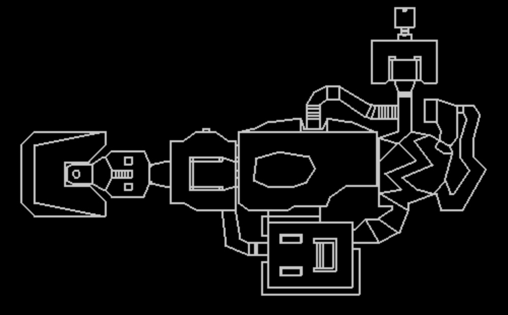

# 03-Automap

Create a file named main2d.py

First let's import our readWad.py file, as well as pygame and other useful modules

```python
from os import read
import readWad
import pygame
import random
import math
```

Lets also use the previously created function to get the data from the WAD and store them

```python
things = readWad.readMapThings()
vertexes = readWad.readMapVertex()
linedefs = readWad.readMapLinedefs()
sidedefs = readWad.readMapSidedefs()
sectors = readWad.readMapSectors()
nodes = readWad.readMapNodes()
segs = readWad.readMapSegs()
subsectors = readWad.readMapSubsectors()
```

Lets also create some basic pygame logic

```python
mapX=100
mapY=500
zoom=10

pygame.init()
display = (1000, 600)
scree = pygame.display.set_mode(display)

displayCenter = [500,300]
mouseMove = [0, 0]
pygame.mouse.set_pos(displayCenter)

paused = False
run = True
clock = pygame.time.Clock()

while run:
    for event in pygame.event.get():
        if event.type == pygame.QUIT:
            run = False
        if event.type == pygame.KEYDOWN:
            if event.key == pygame.K_ESCAPE or event.key == pygame.K_RETURN:
                run = False
            if event.key == pygame.K_PAUSE or event.key == pygame.K_p:
                paused = not paused
                pygame.mouse.set_pos(displayCenter)   

    if not paused:
        scree.fill((0,0,0))
        keypress = pygame.key.get_pressed()

        if keypress[pygame.K_UP]:
            mapY += 100
        if keypress[pygame.K_DOWN]:
            mapY -= 100
        if keypress[pygame.K_LEFT]:
            mapX += 100
        if keypress[pygame.K_RIGHT]:
            mapX -= 100
        if keypress[pygame.K_r]:
            mapX = 100
            mapY = 500
        if keypress[pygame.K_PLUS]:
            zoom -= 2
        if keypress[pygame.K_MINUS]:
            zoom += 2


        pygame.display.flip()
        clock.tick(500)
        pygame.time.wait(100)
pygame.quit()
``` 

So now that we've some pygame logic, let's start drawing some linedefs

```python
def drawWalls():
    for linedef in linedefs:
        l=vertexes[linedef[0]]
        r=vertexes[linedef[1]]
        pygame.draw.line(scree, (200,200,200), (l[0]/zoom+mapX,l[1]/zoom+mapY),(r[0]/zoom+mapX,r[1]/zoom+mapY),2)
```

Yep its that simple. A linedef contains the index of 2 vertexes, we just get the coords of said vertexes and draw a line.



What about drawing sectors? Well thats more complicated.

Lets start the 3d rendering, and we will worry about sectors later